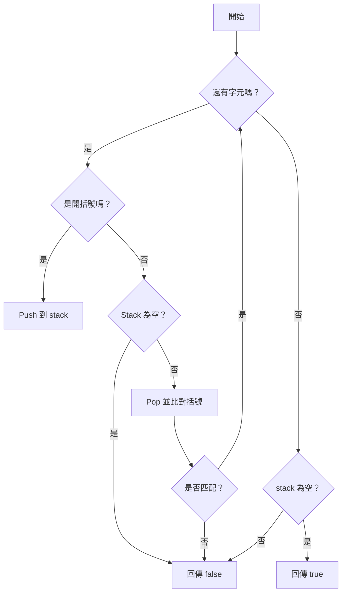

# 📘 括號配對演算法與 Stack 應用比較講義

## 🧩 目標

透過「括號配對」這個常見題目，學習：

- 如何使用 Stack 解決配對問題
- 不同語言實作方式（C#、TypeScript、Python）
- `Dictionary` vs `if` 判斷在邏輯與效能上的比較
- Stack 資料結構在實務中的應用場景

## 📝 LeetCode 題目：20. Valid Parentheses

> Given a string s containing just the characters '(', ')', '{', '}', '[' and ']', determine if the input string is valid.
>
> An input string is valid if:
>
> 1.  Open brackets must be closed by the same type of brackets.
> 2.  Open brackets must be closed in the correct order.
> 3.  Every close bracket has a corresponding open bracket of the same type.

### 範例

**範例 1:**

- **輸入 (Input):** `s = "()"`
- **輸出 (Output):** `true`

**範例 2:**

- **輸入 (Input):** `s = "()[]{}"`
- **輸出 (Output):** `true`

**範例 3:**

- **輸入 (Input):** `s = "(]"`
- **輸出 (Output):** `false`

## 📦 Stack 是什麼？

- 資料結構：**後進先出**（LIFO, Last-In-First-Out）
- 比喻：就像一疊盤子，最後放上去的要先拿下來
- 基本操作：
  | 操作 | 說明 | 常見語法 |
  |----------|-------------------|-----------------------------|
  | Push | 推入堆疊頂部 | `stack.push(x)` / `append()` |
  | Pop | 彈出最上層元素 | `stack.pop()` |
  | Peek | 查看頂部但不移除 | `stack.Peek()`（C#） |
  | isEmpty | 判斷是否為空 | `stack.length === 0` / `not stack` |

## ✅ 括號配對的基本邏輯

1. 建立一個 stack
2. 每遇到一個開括號，就放入 stack
3. 每遇到一個關括號，檢查 stack 是否為空，並與最上層開括號比對是否匹配
4. 最後 stack 必須為空，才能算配對成功

### 📊 流程圖（Mermaid）



## 🧑‍💻 各語言實作版本

### ✅ TypeScript 版本

```ts
function isValid(s: string): boolean {
  const stack: string[] = [];
  const map: Record<string, string> = {
    ")": "(",
    "]": "[",
    "}": "{",
  };

  for (const char of s) {
    if (char === "(" || char === "[" || char === "{") {
      stack.push(char);
    } else if (char in map) {
      if (stack.length === 0 || stack.pop() !== map[char]) {
        return false;
      }
    }
  }

  return stack.length === 0;
}
```

### ✅ Python 版本

```python
def is_valid(s: str) -> bool:
    stack = []
    bracket_map = {')': '(', ']': '[', '}': '{'}

    for char in s:
        if char in '([{':
            stack.append(char)
        elif char in ')]}':
            if not stack or stack.pop() != bracket_map[char]:
                return False

    return len(stack) == 0
```

### ✅ C# 版本（使用 Dictionary）

```csharp
public bool IsValid(string s)
{
    Stack<char> stack = new Stack<char>();
    Dictionary<char, char> map = new Dictionary<char, char>
    {
        { ')', '(' },
        { ']', '[' },
        { '}', '{' }
    };

    foreach (char c in s)
    {
        if (map.ContainsValue(c))
        {
            stack.Push(c);
        }
        else if (map.ContainsKey(c))
        {
            if (stack.Count == 0 || stack.Pop() != map[c])
                return false;
        }
    }

    return stack.Count == 0;
}
```

## 🔍 TypeScript 沒有 `char` 的原因？

- 在 TypeScript / JavaScript 中只有 `string`，**沒有獨立的 `char` 型別**
- 單個字元會以 `string` 表示，長度為 1

```ts
const c: string = "a"; // 雖然像 char，但其實是 string
```

## 🔄 C# 沒有 `Map` 嗎？

- C# 沒有叫 `Map` 的類型，但有功能相同的：

```csharp
Dictionary<TKey, TValue>
```

- 對應其他語言如下：

| 語言       | Map 類型      |
| ---------- | ------------- |
| C#         | Dictionary<,> |
| TypeScript | Map / Record  |
| Python     | dict          |

## 🥊 `if` 判斷 vs `Dictionary` 查表

### ✅ `Dictionary` 優點：

| 項目     | Dictionary 方法               |
| -------- | ----------------------------- |
| 擴充性強 | 只需修改鍵值表                |
| 可讀性高 | 配對邏輯簡單                  |
| 避免錯誤 | 不容易打錯條件                |
| 更易重用 | 可抽成函式 / 支援多種配對規則 |

### ❌ `if` 判斷缺點：

- 條件寫太多不易維護
- 易出錯、不好擴充
- 當配對組多時邏輯複雜

## 🚀 效能差異分析

| 比較項目     | `if` 判斷          | `Dictionary` 查表         |
| ------------ | ------------------ | ------------------------- |
| 執行速度     | 略快（無查表操作） | 慢一點點（查一次鍵）      |
| 可讀性維護性 | 差                 | 高 ✅                     |
| 擴充性       | 差                 | 高 ✅                     |
| 什麼情況用？ | 小題目、短邏輯     | 實務專案、支援變動邏輯 ✅ |

## 📘 延伸學習資源推薦

- Visualgo 資料結構動畫：<https://visualgo.net/en/list>
- LeetCode 題目：Valid Parentheses → <https://leetcode.com/problems/valid-parentheses/>
- 書籍推薦：《Clean Code》by Robert C. Martin
- Stack 原理與實務應用教學：YouTube 搜尋 “stack data structure tutorial”

📚 **學習重點回顧**：

- 使用 Stack 解題要理解「後進先出」原理
- `Dictionary` 更適合擴充與維護
- 效能不是唯一考量，**乾淨與可讀的程式碼才是工程思維**
